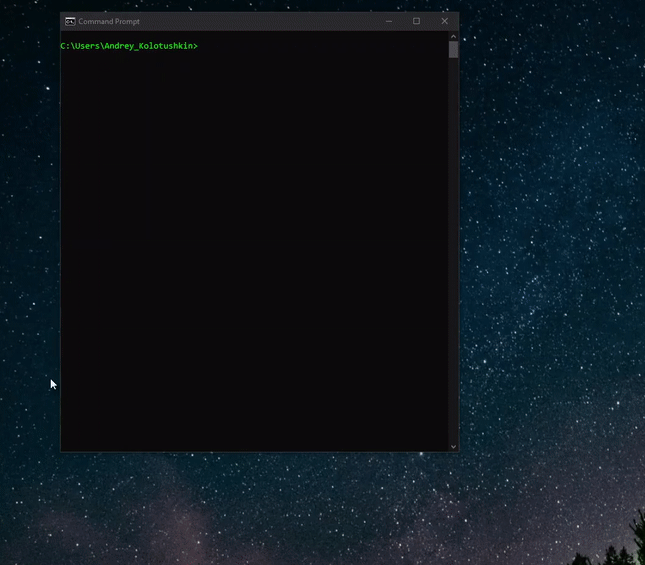

`tagcounter` counts the number of HTML tags on any webpage



**Usage**
---
```
Usage: tagcounter [OPTIONS]

    <url> is the website url without http prefix (e.g. google.com).
    Synonym from a synonyms file can be used instead of <url> (e.g. ggl).
    If no option is passed, GUI variant of the app opens


Options:
    -g, --get <url>         Get tagcounter results from the internet
    -v, --view <url>        View tagcounter results from the database
    -h, --help              Show this message and exit
```

**Installation Options**
---
1. Install with [`pip`](https://pypi.org/project/stronghold/)
    + `$ python -m pip install git+https://github.com/andriusmaximus/tagcounter.git`
    + `$ tagcounter`

2. Download the `tagcounter` binary from `dist` folder.

**Tests**
---
To run the tests please use this command while in the app directory:
```
$ python -m unittest discover .
```


**Acknowledgements**
---
+ This is a purely training project
+ Created by `Andrey Kolotushkin` [@andriusmaximus](https://github.com/andriusmaximus)
+ EPAM team for code review and help